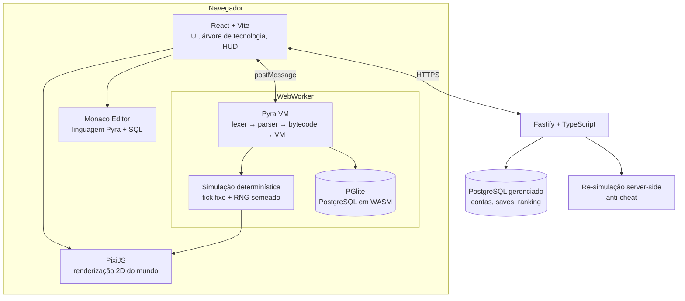

# Plano de Ação - Projeto "Colônia Zero" (nome provisório)

**Jogo interativo para aprender programação e banco de dados, do básico ao avançado.**
Referência de gênero: _The Farmer Was Replaced_ (Timon Herzog / Metaroot, 2025).

Documento versão 1.1 - recalibrado após definição de público, objetivo e ritmo (ver §2, §7 e §13).

---

## 0. Sumário executivo

Um jogo de automação com **progressão contínua** (sem "fases" ou "níveis" fechados), onde o jogador escreve código em uma linguagem própria parecida com Python para comandar robôs, e escreve **SQL real** para consultar e manipular o "Núcleo" - um banco de dados PostgreSQL de verdade rodando dentro do jogo.

O diferencial em relação - referência: lá, você só programa. Aqui, **programação e banco de dados são as duas mãos do mesmo problema**. O jogador descobre, na prática, que um laço `enquanto` de 400 iterações resolve o mesmo que uma query de 3 linhas - e que a query é 50x mais barata. Essa é a lição central do jogo.

**Mecânica-chave (o coração do design):** todo custo é medido em _ticks_. Cada instrução da linguagem custa ticks. Cada query SQL custa ticks proporcionais ao **custo real do plano de execução do PostgreSQL** (`EXPLAIN`). Isso significa que:

- código ruim = robô lento = menos recursos = progressão travada;
- query sem índice = robô travado esperando o Núcleo responder;
- otimizar não é "exercício", é **sobrevivência econômica no jogo**.

Complexidade de algoritmo e indexação de banco deixam de ser teoria e viram uma barra de progresso que o jogador vê andando devagar.

---

## 1. Visão do produto

### 1.1 Premissa narrativa

Uma colônia autônoma perdeu todos os operadores humanos. Restaram os robôs de manutenção e o **Núcleo**, o banco de dados que registra tudo: setores, sensores, estoque, contratos, energia. O jogador é o novo operador remoto. Não pode tocar em nada fisicamente - só pode **escrever código** e **consultar o Núcleo**.

Narrativa mínima, presente apenas como moldura. Nenhum diálogo obrigatório, nenhuma cutscene bloqueante.

### 1.2 O que copiamos da referência (e por quê funciona)

| Elemento                                 | Por que manter                                                                              |
| ---------------------------------------- | ------------------------------------------------------------------------------------------- |
| Progressão contínua, sem níveis fechados | Elimina a sensação de "lição de casa". O jogador nunca é reprovado, só é lento.             |
| Árvore de tecnologia paga com recursos   | Transforma aprendizado em recompensa desejada, não em obrigação.                            |
| Linguagem própria, parecida com Python   | Controle total sobre erros pedagógicos, custo por instrução e liberação gradual de sintaxe. |
| Loop _idle_: aperta "executar" e assiste | Recompensa visual imediata. É o "dopamine hit" que sustenta o resto.                        |
| Conceitos introduzidos um de cada vez    | Carga cognitiva controlada.                                                                 |

### 1.3 O que fazemos diferente (nosso diferencial competitivo)

1. **Banco de dados como pilar de igual peso**, não como enfeite. O estado do mundo _é_ o banco.
2. **Custo de query = tempo de jogo.** Ensina índices e planos de execução visceralmente.
3. **Concorrência real.** Múltiplos robôs disputando o mesmo recurso geram condições de corrida de verdade - o jogador precisa de transações e travas para resolver.
4. **Debugger com viagem no tempo.** Voltar a qualquer tick e inspecionar o estado do mundo e das variáveis. É o recurso que mais impressiona numa demonstração - e o que mais ensina depuração de verdade.
5. **Português e inglês na própria linguagem de programação.** `se/senão/enquanto/função` ou `if/else/while/def`, alternável. Reduz drasticamente a barreira de entrada no mercado BR sem fechar a porta do mercado global.

### 1.4 Não-objetivos (escopo cortado de propósito)

- Multiplayer em tempo real
- Gráficos 3D
- App mobile nativo (o jogo é para teclado)
- Ensinar N linguagens (só a linguagem do jogo + SQL)
- Editor de mods na v1
- Monetização, loja, publicação na Steam _(estacionado - ver §12)_
- Painel de professor e qualquer recurso B2B _(estacionado - ver §12)_

---

## 2. Premissas confirmadas

| #   | Premissa                                         | Status                                                 |
| --- | ------------------------------------------------ | ------------------------------------------------------ |
| P1  | Público: adolescentes 14+ e adultos iniciantes   | - Confirmado                                           |
| P2  | Plataforma: **web** (navegador desktop)          | - Mantido - e reforçado: portfólio exige link clicável |
| P3  | Time: você + eu                                  | - Confirmado                                           |
| P4  | Ritmo: **30h+/semana**                           | - Alterado - cronograma recalibrado em §7              |
| P5  | Objetivo: **portfólio e aprendizado**, não venda | - Alterado - muda §6.12, §9, §11.3 e §12               |
| P6  | Idioma: PT-BR no jogo, EN no código              | - Ajustado (ver abaixo)                                |

### 2.1 O que muda porque o objetivo é portfólio

Isso não reduz o projeto - **muda o que ele precisa provar.** Ninguém contrata por causa de funil de conversão; contrata-se por causa de sistemas difíceis bem resolvidos.

**Sobe de prioridade:**

- O **interpretador** (lexer → parser → bytecode → VM). É a peça mais impressionante do projeto inteiro e a que menos gente do mercado sabe fazer.
- O **PostgreSQL em WASM** com custo de query virando mecânica de jogo. É original e difícil de encontrar em outro portfólio.
- **Determinismo verificável por hash** e a suíte de testes. Sinaliza maturidade de engenharia mais do que qualquer texto no currículo.
- **README, ADRs e deploy público.** Projeto de portfólio sem link funcionando é um anexo quebrado.

**Sai do plano (estacionado em §12):** monetização, página Steam, funil demo → pago, painel de professor, comunidade no Discord, marketing.

**Regra nova:** _se não dá para mostrar ou explicar em 90 segundos, não é prioridade nesta versão._

**Sobre P6 (idioma):** o jogo fala português (é o público), mas **código, commits e nomes de arquivo em inglês**, e README bilíngue. Quem vai avaliar o repositório pode não falar português - e código em inglês é o padrão profissional esperado.

---

## 3. Pilares de design

**P1 - Nada é ensinado antes de ser necessário.**
O jogador só encontra `enquanto` quando um problema torna repetir 20 linhas insuportável. A dor vem antes do remédio. Sempre.

**P2 - Nenhuma mecânica existe só para ensinar.**
Se um sistema não é divertido sozinho, ele é cortado. "É educativo" nunca é justificativa para uma mecânica ruim.

**P3 - Erro é informação, não punição.**
Sem game over, sem vidas, sem tempo esgotando. Erro gera mensagem clara, com sugestão, e volta ao editor com o cursor na linha certa.

**P4 - Otimização é o jogo inteiro.**
O primeiro código que funciona é sempre ruim de propósito. O jogo recompensa reescrever.

**P5 - Determinismo absoluto.**
Mesmo código + mesma semente = mesmo resultado, sempre. Sem isso não há replay, ranking, anti-cheat nem teste automatizado.

---

## 4. O currículo

Duas trilhas paralelas, entrelaçadas pela árvore de tecnologia.

### 4.1 Trilha A - Programação (linguagem "Pyra")

| Tier | Conceito                                                             | Como o jogo força o aprendizado                                |
| ---- | -------------------------------------------------------------------- | -------------------------------------------------------------- |
| A0   | Sequência de comandos                                                | `mover(NORTE)`, `coletar()`, `plantar(FIBRA)` no grid 3-3      |
| A1   | Variáveis, tipos, operadores                                         | Contar recursos antes de decidir                               |
| A2   | Condicionais, booleanos, sensores                                    | `se solo_seco: irrigar()`                                      |
| A3   | Laços (`repita`, `enquanto`)                                         | Grid cresce para 8-8 - copiar/colar vira inviável              |
| A4   | Funções, parâmetros, retorno, escopo                                 | Tarefas repetidas em setores diferentes                        |
| A5   | Listas e iteração                                                    | Fila de tarefas do turno                                       |
| A6   | Dicionários / mapas                                                  | Inventário e contadores por tipo                               |
| A7   | Recursão                                                             | Setor-labirinto e cavernas geradas                             |
| A8   | Busca e ordenação + **complexidade**                                 | Esteira de triagem: o custo em ticks expõe O(n²) vs O(n log n) |
| A9   | Estruturas de dados: pilha, fila, grafo                              | Roteamento entre setores - BFS / Dijkstra                      |
| A10  | **Concorrência**: múltiplos robôs, corrida, deadlock, exclusão mútua | Dois robôs pegam o mesmo item - inventário negativo            |
| A11  | Profiling, memoização, cache                                         | Placar semanal de eficiência                                   |
| A12  | Tratamento de erros e código defensivo                               | Sensores começam a falhar aleatoriamente                       |

### 4.2 Trilha B - Banco de Dados (PostgreSQL real)

| Tier | Conceito                                                         | Como o jogo força o aprendizado                                             |
| ---- | ---------------------------------------------------------------- | --------------------------------------------------------------------------- |
| B0   | Tabela, linha, coluna, `SELECT`                                  | O Núcleo é desbloqueado; o mapa fica grande demais para olhar a olho nu     |
| B1   | `WHERE`, `ORDER BY`, `LIMIT`                                     | "Ache os 5 setores mais secos"                                              |
| B2   | `INSERT` / `UPDATE` / `DELETE`                                   | Registrar colheita e emitir ordens de serviço                               |
| B3   | Tipos, `NOT NULL`, `CHECK`, chave primária                       | Dados inválidos quebram a fábrica de verdade                                |
| B4   | `JOIN` (inner, left)                                             | Cruzar `plantios` → `culturas` → `setores`                                  |
| B5   | `GROUP BY`, agregações, `HAVING`                                 | Relatório de produção libera upgrades                                       |
| B6   | **Índices e `EXPLAIN ANALYZE`**                                  | Query lenta = robô parado esperando. Criar o índice certo é upgrade físico. |
| B7   | Transações, ACID, isolamento, `FOR UPDATE`                       | Contrato precisa ser atômico; robôs concorrentes corrompem o estoque        |
| B8   | CTEs e _window functions_                                        | Ranking de setores, média móvel de produção                                 |
| B9   | Views, triggers, funções PL/pgSQL                                | "O banco trabalha por você" - automação declarativa                         |
| B10  | Normalização (1FN a 3FN) e migrações                             | O jogo entrega um schema legado podre e paga caro pelo refactor             |
| B11  | Chaves estrangeiras, integridade referencial, `EXPLAIN` de joins | Expansão da colônia exige modelagem própria                                 |

### 4.3 A ponte entre as trilhas

```
linhas = consultar("""
    SELECT setor_id, umidade
    FROM sensores
    WHERE umidade < 30
    ORDER BY umidade
    LIMIT 5
""")

para cada linha em linhas:
    ir_para(linha["setor_id"])
    irrigar()
```

E o momento pedagógico mais importante do jogo, o **"Desafio do Espelho"**: o jogo mostra lado a lado a solução imperativa (varrer 400 células com laço) e a declarativa (uma query), com o custo em ticks de cada uma. O jogador não é ensinado que SQL é melhor - ele _vê_ a diferença no cronômetro.

---

## 5. Arquitetura técnica



**Decisões estruturais:**

- Toda a lógica de jogo (`lang`, `sim`, `db`) é **TypeScript puro, sem DOM**. Roda igual no navegador, no Node (testes e anti-cheat) e no CI.
- Execução dentro de **Web Worker**: a UI nunca trava, e o código do jogador fica isolado.
- **Nunca** usar `eval()` ou `new Function()`. Interpretador próprio, sandbox real.
- Save = `{ semente, código, versão_do_schema, estado_serializado }`. Replay = re-executar.

### 5.1 Stack escolhida

| Camada           | Escolha                                  | Justificativa                                                                                        |
| ---------------- | ---------------------------------------- | ---------------------------------------------------------------------------------------------------- |
| Linguagem        | TypeScript (strict)                      | Mesma linguagem cliente/servidor/testes; tipagem essencial num projeto com interpretador             |
| Build            | Vite + pnpm workspaces + Turborepo       | Rápido, monorepo simples, cache de build                                                             |
| UI               | React 18 + Zustand + Tailwind            | Zustand evita a cerimônia do Redux num estado de jogo                                                |
| Editor           | Monaco                                   | Mesmo motor do VS Code; suporta linguagem custom, autocomplete e diagnósticos                        |
| Render           | PixiJS (WebGL 2D)                        | Performático para centenas de sprites; 2D basta                                                      |
| Banco no cliente | **PGlite** (Postgres compilado em WASM)  | PostgreSQL _de verdade_: CTEs, window functions, `EXPLAIN`, triggers. SQLite não ensinaria Postgres. |
| Backend          | Fastify + Drizzle ORM                    | Leve, tipado ponta a ponta                                                                           |
| Banco servidor   | PostgreSQL gerenciado (Neon ou Supabase) | Free tier generoso, branching de banco                                                               |
| Testes           | Vitest + Playwright + fast-check         | Unit, E2E e testes de propriedade para o parser                                                      |
| Deploy           | Cloudflare Pages / Vercel + Fly.io       | Preview por PR                                                                                       |

---

## 6. O comitê de especialistas sênior

Cada área foi planejada como se um especialista sênior fosse dono dela. Cada seção traz: missão, decisões técnicas, entregáveis, riscos e _definition of done_.

---

### 6.1 Arquiteto de Software / Tech Lead

**Missão:** garantir que o sistema continue modificável no mês 6.

**Decisões:**

- Monorepo com fronteira rígida: `lang` não conhece `sim`; `sim` não conhece `ui`. Dependência cruzada quebra o build (checagem no CI).
- Todo contrato entre pacotes validado com **Zod**.
- **ADRs** (Architecture Decision Records) em `docs/adr/` - toda decisão irreversível vira um arquivo numerado.
- Versionamento de save desde o dia 1 (`schema_version`), com migradores. Save quebrado = jogador perdido = review 1 estrela.
- Conventional Commits + semantic release.

**Entregáveis:** monorepo, ADR-0001 a 0008, contratos Zod, pipeline de CI.

**Riscos:**

- _Over-engineering na Fase 1._ - Mitigação: nenhuma abstração antes do terceiro caso de uso real.
- _Acoplamento silencioso._ - Mitigação: `dependency-cruiser` no CI.

**DoD:** `pnpm build && pnpm test` verde em máquina limpa; qualquer pacote roda isolado.

---

### 6.2 Especialista Sênior em Linguagens e Compiladores

**Missão:** construir a linguagem **Pyra** - o produto dentro do produto.

**Pipeline:**

```
código-fonte → Lexer → tokens (+ INDENT/DEDENT) → Parser (descida recursiva)
→ AST → Analisador semântico (escopo, features liberadas) → Compilador
→ Bytecode → VM de pilha (executa N instruções por tick)
```

**Decisões técnicas:**

- **Bytecode + VM de pilha**, não _tree-walking_. Motivo: permite pausar entre instruções, medir custo exato, serializar o estado da execução (save no meio da execução) e implementar _step debugging_ sem gambiarra.
- **Indentação significativa** (estilo Python): o lexer emite `INDENT`/`DEDENT`. Decidido na Fase 1 porque mudar depois é reescrever o parser.
- **Feature gating**: o analisador semântico recebe a lista de recursos desbloqueados na árvore de tecnologia. Usar `enquanto` sem ter desbloqueado gera: _"`enquanto` ainda não está disponível. Desbloqueie 'Laços' na aba Tecnologia (custo: 120 fibras)."_ - nunca um erro de sintaxe cru.
- **Mensagens de erro no padrão Rust/Elm**: linha, coluna, trecho destacado, causa provável e sugestão. Erro de digitação em nome de função - distância de Levenshtein - _"você quis dizer `coletar`?"_.
- **Bilinguismo por tabela de aliases**: `se` → `if`, `senão` → `else`, `enquanto` → `while`, `função` → `def`, `para cada` → `for`. Um só AST, dois vocabulários, alternável a qualquer momento (o código do jogador é reescrito automaticamente).
- **Orçamento de execução**: limite duro de instruções por execução, detecção de laço infinito com mensagem amigável ("seu programa passou de 1.000.000 de passos - provável laço infinito na linha 12").
- **Zero acesso a I/O.** A VM só enxerga a API do jogo.

**Entregáveis:** `packages/lang` - lexer, parser, compilador, VM, formatador, gramática documentada (EBNF), tokenizer Monarch para o Monaco, LSP-lite (autocomplete + diagnósticos em tempo real no worker).

**Riscos:**

- _Escopo do interpretador explodir._ - **Gramática congelada ao fim da Fase 1.** Novos recursos só entram como funções nativas, não como sintaxe nova.
- _Bug sutil no parser destrói saves._ - Suíte de testes _golden_ + `fast-check` (property testing: qualquer AST - imprimir - reparsear = mesma AST).

**DoD:** 100% dos programas do currículo (A0-A12) compilam e executam; >90% de cobertura em `lang`; fuzzing 1h sem crash não tratado.

---

### 6.3 Especialista Sênior em Banco de Dados (PostgreSQL)

**Missão:** o Núcleo. Fazer o banco ser mecânica de jogo, não formulário.

**Decisões técnicas:**

- **PGlite** no cliente (PostgreSQL real em WASM, ~3 MB). Carregado sob demanda, só quando o Núcleo é desbloqueado - não pesa no primeiro minuto de jogo.
- Schema do jogo versionado com migrações reais (`drizzle-kit`). O jogador vive as migrações no jogo: expandir a colônia = rodar `ALTER TABLE`.
- **Custo de query - ticks:** rodar `EXPLAIN (FORMAT JSON, ANALYZE false)`, extrair `Total Cost`, aplicar curva log e converter em ticks. Query sem índice numa tabela de 50k linhas trava o robô por segundos reais.
- **Validação de exercícios em dois níveis:**
  1. _Resultado_: comparação de conjuntos (ignora ordem quando não há `ORDER BY`, ignora nomes de colunas quando irrelevante).
  2. _Plano_: alguns desafios exigem que o plano contenha `Index Scan` - não basta acertar, tem que acertar rápido.
- **Sandbox SQL:** role restrita, `statement_timeout`, bloqueio de `COPY`, `pg_read_file`, funções de sistema e DDL fora do escopo permitido pelo tier atual.
- **Tabelas do Núcleo (v1):** `setores`, `sensores`, `culturas`, `plantios`, `colheitas`, `estoque`, `robos`, `ordens`, `contratos`, `eventos` (log append-only), `energia`.
- Dados sintéticos crescem com a partida - na Fase 4 o Núcleo tem centenas de milhares de linhas, e aí índice deixa de ser opcional.
- Banco do servidor (contas/progresso/ranking) é **totalmente separado** do banco do jogo. Nunca se misturam.

**Entregáveis:** `packages/db` - schema, migrações, seeds, analisador de custo, validador de exercícios, catálogo de desafios SQL (B0-B11) com solução canônica e casos de teste.

**Riscos:**

- _PGlite não suportar algum recurso._ - **Ação da Fase 0:** validar hoje CTE, window function, trigger, PL/pgSQL e `EXPLAIN` no PGlite. Se falhar em algo crítico, plano B: Postgres real no servidor com sessão por jogador (custo maior, latência maior).
- _Peso do WASM na primeira carga._ - Lazy load + cache no OPFS/IndexedDB.
- _Jogador travar o próprio banco._ - `statement_timeout` + botão "restaurar Núcleo" com snapshot.

**DoD:** todos os desafios B0-B11 com solução canônica passando; custo de query refletido no HUD; restauração de snapshot em <2s.

---

### 6.4 Especialista Sênior em Backend

**Missão:** contas, progresso, ranking e integridade - sem virar o gargalo do projeto.

**Decisões:**

- Fastify + TypeScript + Drizzle. REST simples; WebSocket só para o ranking ao vivo.
- Auth: e-mail mágico + OAuth (GitHub/Google). Sem senha própria, sem dor de cabeça.
- **Save é do jogador**: funciona 100% offline (IndexedDB). A nuvem é sincronização, não requisito. O jogo precisa ser jogável sem login.
- **Anti-cheat por re-simulação**: o servidor recebe `{código, semente}`, roda o mesmo `packages/sim` em Node e confere o hash do estado final. Impossível forjar ranking sem reescrever o jogo.
- Telemetria de aprendizado (anônima, com consentimento): em que tier o jogador trava, quantas tentativas até acertar, quais erros são mais comuns. É o que vai guiar o balanceamento.
- Rate limiting, Zod em toda borda, logs estruturados.

**Entregáveis:** `apps/api`, esquema OpenAPI, worker de re-simulação, pipeline de telemetria.

**Riscos:**

- _Backend antes da hora._ - **Backend só existe a partir da Fase 5.** Antes disso, tudo local.
- _Custo de re-simulação._ - Só para submissões de ranking, com fila.

**DoD:** ranking com re-simulação; jogo 100% funcional com o backend desligado.

---

### 6.5 Especialista Sênior em Frontend e Game Dev

**Missão:** transformar o simulador numa coisa gostosa de olhar.

**Decisões:**

- Layout: editor - esquerda (~45%), mundo - direita, HUD de recursos no topo, console/resultado SQL embaixo. Painéis redimensionáveis, layout persistido.
- **Monaco** com linguagem Pyra registrada: destaque de sintaxe, autocomplete ciente do tier desbloqueado, sublinhado de erro em tempo real, ir-para-definição em funções do jogador.
- **PixiJS** com _sprite pooling_; renderização desacoplada da simulação (a sim roda em ticks lógicos, o render interpola).
- **Controle de velocidade**: 0.5x / 1x / 4x / 16x / instantâneo. O modo instantâneo é essencial para otimização (rodar 10.000 ticks e ver só o resultado).
- **Scrubber de replay**: voltar no tempo e ver o estado do mundo e das variáveis em qualquer tick. Isso é o _debugger_ do jogo - e é o que ensina depuração de verdade.
- Estado de UI em Zustand; o estado do jogo mora no worker e chega por mensagem (nunca duplicado).
- Code-splitting agressivo: Monaco e PGlite carregam sob demanda.

**Entregáveis:** `apps/web`, `packages/ui`, tema visual, painel do Núcleo com grid virtualizada.

**Riscos:**

- _Monaco pesado (~2 MB)._ - Lazy load + só os recursos usados.
- _UI travar com muitos sprites._ - Orçamento: 60fps com 500 entidades; teste de performance no CI.

**DoD:** 60fps no vertical slice; primeira interação em <3s numa conexão 4G.

---

### 6.6 Especialista Sênior em Design Instrucional

**Missão:** garantir que a pessoa realmente aprenda - e consiga levar o conhecimento para fora do jogo.

**Decisões:**

- **Zona de desenvolvimento proximal**: cada desafio novo fica ~1 conceito - frente do que o jogador domina. Nunca 2.
- **Scaffolding decrescente**: o primeiro uso de um conceito vem com exemplo pronto; o segundo, com esqueleto; o terceiro, em branco.
- **Sem tutorial longo.** Máximo 3 frases por conceito, dentro do contexto. Documentação completa disponível em painel lateral pesquisável (`F1`), nunca imposta.
- **Repetição espaçada**: conceitos antigos reaparecem em contextos novos - desafios semanais forçam combinar A5 + B4 + A8.
- **Ponte para o mundo real**: cada conceito tem um cartão "no mundo real" mostrando o equivalente em Python e em SQL padrão. O jogador precisa saber que `função` é `def`. Sem isso, ensinamos um dialeto inútil.
- **Métricas de aprendizado**: tempo até o primeiro sucesso por tier, taxa de abandono por tier, número de tentativas, taxa de reescrita voluntária de código (indicador de que o jogador entendeu otimização).

**Entregáveis:** currículo detalhado em `packages/content` (YAML validado por Zod), textos, cartões de conceito, roteiro de onboarding dos 10 primeiros minutos.

**Riscos:**

- _Muro de dificuldade em A7 (recursão) e B6 (índices)._ - São os dois pontos históricos de abandono. Ambos ganham um desafio-ponte extra e visualização animada dedicada.
- _Jogador copiar solução da internet e não aprender._ - Aceitável. Mas: desafios semanais com semente aleatória tornam a cópia inútil no ranking.

**DoD:** 8 pessoas em playtest, sendo 4 sem experiência prévia, concluindo até A4/B2 sem ajuda externa.

---

### 6.7 Especialista Sênior em Game Design e Economia

**Missão:** fazer com que o jogador queira continuar depois que a novidade passa.

**Decisões:**

- **Sem níveis. Sem game over. Sem timer.** Só progressão.
- Moedas: `fibra`, `energia`, `dados` (recurso do Núcleo), `liga` (avançado). Cada trilha do currículo consome uma moeda diferente - evita que o jogador ignore o banco de dados.
- Curva de custo exponencial (~1.6x por upgrade), calibrada para que cada desbloqueio seja alcançável em 5-15 min de otimização.
- **Prestígio ("Reinicialização do Núcleo")**: recomeça mantendo bônus e o código escrito. Dá vida longa e ensina refatoração.
- **Desafios semanais** com semente fixa e ranking por ticks. É a mecânica de retenção de longo prazo.
- Conquistas ligadas a conceitos ("resolveu em O(n log n)", "criou o índice certo", "transação atômica sob concorrência").

**Entregáveis:** planilha de balanceamento, árvore de tecnologia (~60 nós), especificação da economia.

**Riscos:**

- _Grind chato._ - Regra: nenhum upgrade pode exigir mais de 15 min de espera passiva. Se exigir, o problema é a curva, não o jogador.
- _Jogador ignorar a trilha de banco._ - Nós da árvore de tecnologia que exigem `dados` ficam no caminho crítico. Não dá para pular.

**DoD:** simulação de balanceamento (script) mostrando progressão saudável nas primeiras 10h.

---

### 6.8 Especialista Sênior em DevOps / SRE

**Decisões:** GitHub Actions (lint → typecheck → test → build → E2E → deploy). Preview deploy por PR. Cloudflare Pages/Vercel no front, Fly.io na API, Neon no banco. Sentry para erros, com _source maps_. Feature flags para ligar tiers em produção sem redeploy. Backup diário do banco de contas.

**Entregáveis:** pipelines, IaC mínima, runbook de incidentes.

**Riscos:** _CI lento matando a produtividade_ - orçamento de 5 min para o pipeline principal; E2E completo só em `main` e noturno.

**DoD:** commit em `main` chega em produção em <10 min, com rollback em 1 clique.

---

### 6.9 Especialista Sênior em QA e Testes

**Decisões:**

- **Vitest** para `lang`, `sim`, `db` (alvo: 90% em `lang`, 85% em `sim`).
- **Testes de determinismo**: mesmo código + mesma semente - mesmo hash SHA-256 do estado final, em 10.000 ticks. Roda no CI. É o teste mais importante do projeto.
- **Property testing** (`fast-check`) no parser e no formatador.
- **Testes de currículo**: toda solução canônica de A0-A12 e B0-B11 é um teste automatizado. Se um refactor quebra uma lição, o CI acusa.
- **Playwright** para os fluxos críticos: onboarding, executar código, comprar upgrade, salvar/carregar.
- **Testes de regressão de save**: saves da versão anterior precisam carregar.
- Benchmarks de performance com limite de regressão (>10% mais lento = build falha).

**DoD:** suíte completa <5 min; zero teste instável tolerado (_flaky_ = corrigir ou deletar, nunca ignorar).

---

### 6.10 Segurança

**Decisões:**

- Execução do código do jogador: Web Worker isolado, sem `eval`, sem acesso a `fetch`/`localStorage`, limite de passos e de memória.
- SQL do jogador roda só no PGlite local - sem superfície de ataque no servidor. O SQL **nunca** trafega para o banco do servidor.
- CSP restritiva, sem `unsafe-eval` (o interpretador próprio permite isso - mais uma razão para não usar `eval`).
- Validação Zod em toda entrada da API; rate limit por IP e por conta; sem PII além do e-mail.
- **LGPD**: política clara, consentimento explícito para telemetria, exclusão de conta funcionando de verdade. Se o público incluir menores de 16, é necessário consentimento parental - decisão que depende da premissa P1.
- Dependências: `pnpm audit` no CI + Dependabot.

**DoD:** revisão de segurança documentada antes do beta público; política de privacidade publicada.

---

### 6.11 Especialista Sênior em UX/UI e Acessibilidade

**Decisões:** desktop-first (teclado é obrigatório), tablet como degradação graciosa, mobile só leitura/vitrine. Temas claro e escuro. Paleta segura para daltonismo (nunca só cor para transmitir estado - sempre cor + forma + texto). WCAG 2.1 AA. Navegação completa por teclado. Fonte monoespaçada com ligaduras (JetBrains Mono). Atalhos estilo VS Code (`Ctrl+Enter` executa, `Ctrl+.` sugestões) - familiaridade transferível. Redução de movimento respeitada (`prefers-reduced-motion`).

**DoD:** auditoria Axe sem violações críticas; jogo completável só com teclado.

---

### 6.12 Especialista Sênior em Posicionamento de Portfólio

**Missão:** garantir que o projeto seja **legível** para quem vai avaliá-lo - um recrutador técnico, um tech lead numa entrevista, ou você mesmo daqui a um ano.

**Decisões:**

- **Deploy público com URL fixa a partir da Fase 2**, atualizado ao fim de cada fase. Não negociável.
- **Repositório público desde o dia 1.** O histórico de commits _é_ parte do portfólio: mostra evolução, disciplina e capacidade de decompor problema.
- **README como peça principal**, nesta ordem: GIF de 10s no topo - o problema técnico em 3 parágrafos - diagrama de arquitetura - "como rodar em 2 comandos" - decisões e trade-offs - link para os ADRs - badges de CI e cobertura.
- **Os três argumentos técnicos do projeto**, em ordem de impacto: (1) compilador e máquina virtual próprios; (2) PostgreSQL real em WASM com custo de plano de execução virando mecânica; (3) simulação determinística verificável por hash no CI.
- **Devlog curto ao fim de cada fase** (dev.to, LinkedIn ou GitHub Discussions). Cada post é uma prova pública de raciocínio - e é o que gera conversa em entrevista.
- **Preparar duas apresentações:** uma demo de 90 segundos e uma explicação técnica de 5 minutos. Você vai usar as duas.

**Riscos:**

- _Projeto eterno, nunca mostrado._ - Publicar ao fim de cada fase, mesmo feio. Este é o risco nº 1 de projeto de portfólio.
- _Parecer "só um joguinho"._ - O README precisa deixar explícito, na primeira tela, que existe um compilador e um banco de dados de verdade ali dentro.

**DoD:** link público funcionando, README completo, demo de 90s gravada, 6 posts de devlog.

---

## 7. Roadmap por fases

> Recalibrado para **~30h/semana** (P4 confirmado) e objetivo de portfólio (P5). Marcos são critérios de saída, não datas.
>
> Dobrar as horas não corta o prazo pela metade: parte do tempo é aprendizado, não digitação. Apliquei fator 1,7x em vez de 2x.
>
> **Regra de publicação:** ao fim de cada fase - deploy atualizado + post de devlog. Sem exceção. É o que impede o projeto de virar eterno.

### Fase 0 - Fundação e validação técnica (3 dias)

- [ ] Confirmar as premissas P1-P6
- [ ] **Spikes de risco** (fazer antes de qualquer outra coisa):
  - PGlite roda CTE, window function, trigger, PL/pgSQL e `EXPLAIN (FORMAT JSON)`?
  - Monaco aceita linguagem custom com diagnósticos vindos de worker?
  - Quanto tempo leva a primeira carga com PGlite + Monaco?
- [ ] Monorepo, CI, ESLint/Prettier, ADR-0001..0003
- **Saída:** três spikes respondidos por escrito. Se o PGlite falhar, o plano muda aqui - e só aqui.

### Fase 1 - A linguagem Pyra (1,5 semana)

- [ ] Lexer com INDENT/DEDENT, parser, AST, compilador, VM de pilha
- [ ] Mensagens de erro pedagógicas + tabela de aliases PT/EN
- [ ] Simulação determinística _headless_ (grid, robô, recursos, tick fixo)
- [ ] CLI: `pnpm pyra run programa.pyra` - o jogo roda no terminal, sem UI
- [ ] Testes de determinismo e property testing
- **Saída:** um robô ASCII no terminal colhendo o grid. Gramática **congelada**.

### Fase 2 - Vertical slice jogável (2 semanas) - **primeiro deploy público**

- [ ] Editor Monaco + mundo em PixiJS + HUD
- [ ] Tiers A0-A4 completos
- [ ] Árvore de tecnologia com 12 nós; economia básica
- [ ] Save/load local; controle de velocidade
- [ ] Onboarding dos 10 primeiros minutos
- [ ] **Deploy público + README com GIF** (a partir daqui o projeto existe para o mundo)
- **Saída:** 30 minutos de jogo divertidos, num link que você pode mandar para alguém. Playtest com 5 pessoas. **Se não for divertido aqui, o problema é o design - e paramos para corrigir antes de seguir.**

### Fase 3 - O Núcleo (2 semanas)

- [ ] PGlite integrado, schema do jogo, seeds
- [ ] Painel SQL com grid de resultados
- [ ] Tiers B0-B5
- [ ] Função-ponte `consultar()` e o "Desafio do Espelho"
- [ ] Custo de query em ticks via `EXPLAIN`
- **Saída:** as duas trilhas se entrelaçam; o produto passa a ser único no mercado.

### Fase 4 - Profundidade (2,5 semanas)

- [ ] Tiers A5-A10 (inclui concorrência) e B6-B9 (índices, transações, CTEs, triggers)
- [ ] Múltiplos robôs + condições de corrida reais
- [ ] Scrubber de replay / debugger visual
- [ ] Árvore de tecnologia completa (~60 nós); balanceamento
- **Saída:** currículo completo jogável de ponta a ponta.

### Fase 5 - Plataforma e full-stack (1,5 semana)

> Nesta fase o backend não existe para "escalar" - existe para **demonstrar competência full-stack** num projeto que, de resto, é todo cliente. Por isso o recorte é mínimo e cirúrgico.

- [ ] Backend Fastify + Drizzle + Postgres; sync de save
- [ ] Auth só por OAuth (GitHub/Google) - sem e-mail mágico, sem senha
- [ ] **Ranking com re-simulação anti-cheat** - a peça de destaque desta fase
- [ ] Desafios semanais com semente fixa
- **Saída:** o projeto deixa de ser front-end puro. Cortado da v1.0: telemetria de aprendizado (bom para produto, irrelevante para portfólio).

### Fase 6 - Polimento e apresentação (2 semanas)

- [ ] Feedback visual, juice, arte e som mínimos porém coerentes
- [ ] i18n PT/EN completo, acessibilidade auditada (Axe)
- [ ] Playtest com 8-10 pessoas; balanceamento
- [ ] **README definitivo, GIF, demo de 90s gravada, série de devlogs, diagrama de arquitetura**
- [ ] Ensaiar a explicação técnica de 5 minutos
- **Saída:** projeto publicado e apresentável. Cortado da v1.0: landing page comercial e página Steam.

**Total: ~11,5 semanas (~3 meses).** Primeiro artefato mostrável ao mundo: **fim da semana 4** (Fase 2).

---

## 8. Backlog concreto da primeira semana (Fase 0)

1. `pnpm create` do monorepo + Turborepo + TS strict + ESLint/Prettier
2. Spike A: projeto isolado com PGlite rodando as 5 queries de risco (2h)
3. Spike B: Monaco com linguagem fictícia + diagnóstico vindo de worker (3h)
4. Spike C: medir _bundle size_ e tempo de carga com Monaco + PGlite juntos (1h)
5. ADR-0001 (monorepo), ADR-0002 (bytecode vs tree-walking), ADR-0003 (PGlite)
6. Esqueleto de `packages/lang` com lexer + 20 testes
7. Definir a gramática EBNF da Pyra por escrito **antes** de escrever o parser
8. GitHub Actions rodando lint + test

---

## 9. Métricas de sucesso

**Portfólio (o que prova o objetivo):** link público no ar desde a semana 4 · README com GIF, arquitetura e trade-offs · 6 posts de devlog · demo de 90s gravada · ADRs publicados · badges de CI e cobertura verdes.

**Técnico (o que prova competência):** cobertura ≥90% em `lang` e ≥85% em `sim` · determinismo verificado por hash no CI · primeira interação <3s · 60fps com 500 entidades · pipeline de CI <5 min.

**Aprendizado - do jogador:** em playtest, ≥6 de 8 pessoas chegam ao tier B4 (JOIN) sem ajuda externa.

**Aprendizado - seu (o motivo nº 2 do projeto):** você consegue explicar, sem consultar o código, o pipeline completo do compilador, por que escolheu bytecode em vez de _tree-walking_, e como o custo do plano do Postgres vira tick de jogo. Se você não consegue explicar, você não aprendeu - só digitou.

---

## 10. Riscos gerais e planos B

| Risco                               | Prob.    | Impacto | Mitigação / Plano B                                                                               |
| ----------------------------------- | -------- | ------- | ------------------------------------------------------------------------------------------------- |
| PGlite insuficiente                 | Média    | Alto    | Plano B: Postgres real no servidor, sessão por jogador (spike na Fase 0 decide)                   |
| Escopo explodir                     | **Alta** | Alto    | Fases com critério de saída; gramática congelada; lista de não-objetivos (§1.4)                   |
| "Educativo demais, jogo de menos"   | Média    | Fatal   | Pilar P2; playtest obrigatório na Fase 2 com poder de veto                                        |
| Determinismo quebrar                | Média    | Alto    | Sem ponto flutuante na simulação (inteiros/fixed-point), RNG semeado (PCG32), teste de hash no CI |
| Interpretador consumir tempo demais | Alta     | Médio   | Subset mínimo; nenhuma sintaxe nova após a Fase 1                                                 |
| Desmotivação em projeto longo       | Média    | Alto    | Fase 2 entrega algo demonstrável em ~7 semanas; devlog público cria pressão saudável              |
| Concorrência (a referência é forte) | Média    | Médio   | Diferencial de banco de dados + português nativo + painel B2B                                     |

---

## 11. Ambiente de desenvolvimento (VS Code)

### 11.1 Instalar na máquina

| Ferramenta                 | Versão   | Observação                                                   |
| -------------------------- | -------- | ------------------------------------------------------------ |
| **Node.js**                | 22 LTS   | Base de tudo                                                 |
| **pnpm**                   | 9+       | `corepack enable && corepack prepare pnpm@latest --activate` |
| **Git**                    | recente  | -                                                            |
| **Docker Desktop**         | recente  | Postgres local (Fase 5); opcional até lá                     |
| **VS Code**                | recente  | -                                                            |
| **JetBrains Mono**         | -        | Fonte do editor e do jogo                                    |
| **DBeaver** ou **pgAdmin** | opcional | Inspecionar o banco fora do jogo                             |

### 11.2 Extensões do VS Code

**Essenciais**

- `dbaeumer.vscode-eslint` - ESLint
- `esbenp.prettier-vscode` - Prettier
- `EditorConfig.EditorConfig`
- `usernamehw.errorlens` - mostra o erro na própria linha (ganho enorme de produtividade)
- `yoavbls.pretty-ts-errors` - erros de TypeScript legíveis (indispensável com tipos complexos)
- `eamodio.gitlens`
- `christian-kohler.path-intellisense`

**Testes**

- `vitest.explorer` - Vitest
- `ms-playwright.playwright` - E2E

**Front-end**

- `bradlc.vscode-tailwindcss` - Tailwind IntelliSense
- `antfu.iconify`

**Banco de dados**

- `ms-ossdata.vscode-pgsql` _(ou)_ `mtxr.sqltools` + `mtxr.sqltools-driver-pg`

**Documentação e organização**

- `yzhang.markdown-all-in-one`
- `bierner.markdown-mermaid` - pré-visualizar os diagramas deste plano
- `gruntfuggly.todo-tree`
- `streetsidesoftware.code-spell-checker` + `streetsidesoftware.code-spell-checker-portuguese-brazilian`
- `redhat.vscode-yaml` - para os arquivos de currículo

**Infra**

- `ms-azuretools.vscode-docker`
- `ms-vscode-remote.remote-containers` - Dev Containers (garante ambiente idêntico)
- `github.vscode-github-actions`

**Assistência**

- **Claude Code para VS Code** - é como vamos trabalhar juntos direto no repositório: eu leio os arquivos, escrevo código, rodo testes e faço refactors no seu projeto pelo terminal ou pela barra lateral do VS Code. Recomendo instalar antes de começarmos a Fase 0.

### 11.3 Contas necessárias (todas com plano gratuito suficiente)

GitHub (repositório **público** + Actions) · Vercel ou Cloudflare Pages (deploy público desde a Fase 2) · Neon ou Supabase (Postgres, só na Fase 5) · Sentry (opcional).

**Nada pago é necessário.** Removidos da v1.0: Discord e Steamworks (US$ 100) - só fariam sentido com objetivo comercial.

### 11.4 Estrutura do monorepo

```
colonia-zero/
├── apps/
│   ├── web/                 # Vite + React (o jogo)
│   └── api/                 # Fastify (Fase 5)
├── packages/
│   ├── lang/                # Pyra: lexer, parser, compilador, VM
│   ├── sim/                 # Simulação determinística (sem DOM)
│   ├── db/                  # PGlite, schema, migrações, custo de query
│   ├── content/             # Currículo, árvore de tecnologia, desafios (YAML+Zod)
│   ├── ui/                  # Componentes React compartilhados
│   └── shared/              # Tipos, contratos Zod, utilitários
├── tools/
│   ├── cli/                 # pnpm pyra run
│   └── balance/             # simulador de economia
├── docs/
│   ├── adr/                 # decisões de arquitetura
│   ├── grammar.ebnf         # gramática da Pyra
│   └── curriculum.md
├── e2e/                     # Playwright
└── .github/workflows/
```

---

## 12. Estacionado - extensões possíveis depois do portfólio pronto

Nada aqui entra nas 11,5 semanas. Está registrado porque a arquitetura foi desenhada para não impedir nenhuma dessas coisas - e porque _mencionar no README que o projeto comporta essas extensões_ já demonstra visão de produto, sem custar uma linha de código.

- **Modo Professor/Empresa (B2B):** turmas, atribuição de desafios, painel de progresso por aluno, identificação de onde cada um travou, desafios customizados, SSO. Reaproveitaria ~90% do motor.
- **Monetização B2C:** demo web gratuita até A4/B2 + versão completa paga.
- **Empacotamento desktop** via Tauri e publicação na Steam.
- **Novos módulos de currículo:** Git, redes, expressões regulares, teoria dos grafos.
- **Editor de desafios da comunidade**, com validação automática por solução canônica.

Se em algum momento o objetivo mudar de portfólio para produto, o caminho de volta é: reativar §6.12 na versão comercial e retomar as Fases 5 e 6 com o escopo original da v1.0 deste documento.

---

## 13. Revisão crítica do plano (red team)

_Esta seção é a revisão pedida: onde o plano acima estava errado ou frágil, e o que mudou._

**Problema 1 - A primeira versão do plano tinha 4 linguagens (Python, JS, SQL, Rust).**
Diagnóstico: seria um curso, não um jogo, e nenhuma das quatro ficaria boa.
_Correção aplicada:_ uma linguagem própria + SQL real. A profundidade vem dos conceitos (concorrência, complexidade, ACID), não da quantidade de sintaxes.

**Problema 2 - Banco de dados corria o risco de virar minigame decorativo.**
Diagnóstico: em quase todo jogo educativo, o pilar secundário vira formulário disfarçado.
_Correção aplicada:_ o estado do mundo _é_ o banco; recursos exigem `dados` no caminho crítico da árvore de tecnologia; custo de query = tempo de jogo. Não dá para ignorar o banco e vencer.

**Problema 3 - Backend estava na Fase 2 do plano original.**
Diagnóstico: é a forma clássica de gastar um mês sem ter jogo nenhum.
_Correção aplicada:_ backend empurrado para a Fase 5. Nada de conta, login ou nuvem antes de o jogo ser divertido offline.

**Problema 4 - Interpretador com escopo aberto.**
Diagnóstico: interpretador é um buraco negro de tempo; sempre cabe mais um recurso.
_Correção aplicada:_ gramática **congelada** ao fim da Fase 1. Depois disso, extensões só como funções nativas.

**Problema 5 - Nenhum ponto de verificação de diversão.**
Diagnóstico: o plano media entregas técnicas, não a única coisa que importa.
_Correção aplicada:_ a Fase 2 tem playtest com poder de veto. Se 5 pessoas não se divertirem por 30 minutos, o projeto para e o design é revisto - antes de investir 4 semanas no banco.

**Problema 6 - Determinismo tratado como detalhe.**
Diagnóstico: sem determinismo não existe replay, ranking, anti-cheat nem teste confiável - e descobrir isso na Fase 5 significa reescrever a simulação.
_Correção aplicada:_ virou pilar de design (P5), com teste de hash no CI desde a Fase 1 e proibição de ponto flutuante na simulação.

**Problema 7 - PGlite era premissa não verificada.**
Diagnóstico: o plano inteiro dependia de uma tecnologia que ninguém testou.
_Correção aplicada:_ virou o spike nº 1 da Fase 0, com plano B escrito.

**Problema 8 - a v1.0 inteira assumia produto comercial (corrigido na v1.1).**
Diagnóstico: com o objetivo real sendo portfólio e aprendizado, cerca de 30% do plano - monetização, funil, B2B, Steam, telemetria de produto, comunidade - era trabalho que não prova nada tecnicamente e adia justamente o que prova.
_Correção aplicada:_ essas frentes foram para §12 como "estacionado"; deploy público e README subiram para requisito de saída de fase; a Fase 5 foi reenquadrada como demonstração full-stack em vez de infraestrutura de produto; cronograma recalibrado de 22 para ~11,5 semanas com 30h/semana.

**Problema 9 - risco novo criado pelo próprio objetivo de portfólio.**
Diagnóstico: projeto de portfólio tem uma forma clássica de morrer que produto comercial não tem - ficar bonito no repositório e nunca ser mostrado, sempre "faltando um pouquinho".
_Correção aplicada:_ regra de publicação obrigatória ao fim de cada fase (§7) e primeiro link público na semana 4, não no final.

**O que ainda me preocupa e não tem solução no papel:**
o equilíbrio entre "jogo de verdade" e "ferramenta de ensino" só se resolve com playtest. Nenhum documento decide isso. Por isso a Fase 2 existe do jeito que existe.

---

## 14. Próximos passos - Dia 1 da Fase 0

Premissas fechadas. O plano está pronto para execução. Checklist do primeiro dia (~6h):

**Antes de me chamar no VS Code:**

1. Instalar Node 22 LTS, pnpm, Git, VS Code e as extensões de §11.2 - inclusive a **Claude Code para VS Code**.
2. Criar o repositório `colonia-zero` no GitHub, **público**, com licença MIT.
3. Decidir o tema. "Colônia autônoma" é sugestão; fábrica, laboratório, cidade ou estação espacial funcionam igual. Muda só a camada visual, não a arquitetura - mas é melhor decidir antes de nomear as tabelas do banco.

**Comigo, na ordem (a ordem importa - os spikes podem mudar o plano):** 4. Scaffold do monorepo: pnpm workspaces + Turborepo + TypeScript strict + ESLint/Prettier + CI. 5. **Spike A (~2h):** PGlite rodando CTE, _window function_, trigger, PL/pgSQL e `EXPLAIN (FORMAT JSON)`. É o spike que decide se o plano continua de pé. 6. **Spike B (~3h):** Monaco com linguagem fictícia, destaque de sintaxe e diagnóstico vindo de um Web Worker. 7. **Spike C (~1h):** medir _bundle size_ e tempo da primeira carga com Monaco + PGlite juntos. 8. Escrever ADR-0001, 0002 e 0003 com o resultado dos spikes.

Só depois disso escrevemos a primeira linha do lexer. Escrever o interpretador antes de saber se o PGlite aguenta seria construir a casa sem checar o terreno.
