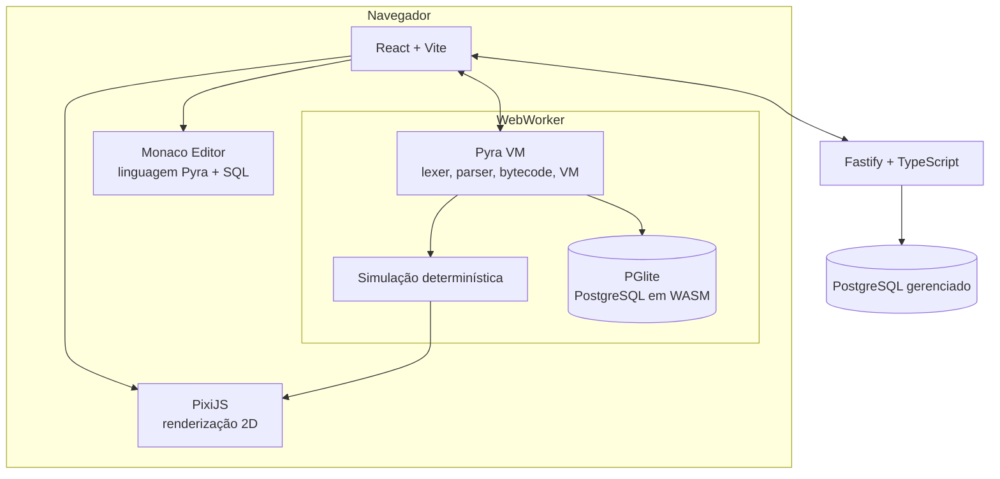

# Colônia Zero

[](https://github.com/Streche/colonia-zero/actions/workflows/ci.yml)
[](LICENSE)

> **For English-speaking readers:** this is an in-browser game for learning
> programming and databases. The player writes code in a custom language
> (Pyra) to control robots, and real SQL against an actual PostgreSQL
> instance compiled to WASM (PGlite) and running client-side. Query cost
> from `EXPLAIN` becomes in-game tick cost, so a bad query is felt as
> slowness, not just graded. The rest of this README is in Portuguese for
> now (the game's own language); a full bilingual pass is planned for
> later phases (see Roteiro below).

Jogo interativo para aprender programação e banco de dados, do básico ao
avançado, escrevendo código numa linguagem própria (Pyra) para comandar
robôs e SQL real contra um PostgreSQL de verdade rodando dentro do
navegador (PGlite, Postgres compilado para WASM). Referência de gênero:
_The Farmer Was Replaced_.

## O que torna isso diferente

Na maioria dos jogos "educativos", o banco de dados vira um formulário
disfarçado. Aqui não: o estado do mundo _é_ o banco. Recursos do jogo
exigem consultas SQL no caminho crítico da árvore de tecnologia, e o
custo de cada query (extraído de `EXPLAIN (FORMAT JSON)` de verdade) vira
tempo de jogo. Um `while` de 400 iterações e uma query de 3 linhas podem
resolver o mesmo problema, só que uma delas é 50 vezes mais barata, e o
jogador sente essa diferença no cronômetro, não em uma explicação de
professor.

Outros pontos fora da curva de um jogo educativo comum:

- **Concorrência real.** Vários robôs disputando o mesmo recurso geram
  condições de corrida de verdade, não simuladas.
- **Debugger com viagem no tempo.** Voltar a qualquer tick e inspecionar
  o estado do mundo e das variáveis naquele momento.
- **Bilinguismo na própria linguagem.** `se/senao/enquanto/funcao` ou
  `if/else/while/def`, alternável a qualquer momento.

O documento completo de design, com o currículo (trilhas A0 a A12 de
programação e B0 a B11 de banco de dados), a arquitetura, o roteiro de
seis fases e uma autocrítica estruturada das decisões (seção 13), está em
[`PLANO-DE-ACAO-colonia-zero.md`](PLANO-DE-ACAO-colonia-zero.md).

## Estado atual

**Fase 0 (fundação e validação técnica) concluída em 2026-09-04.** Ainda
não há jogo jogável, mas o maior risco técnico do projeto já foi testado
e resolvido: o PGlite realmente suporta CTE, window function,
trigger/PL-pgSQL e `EXPLAIN`, então a arquitetura original se mantém sem
precisar de um plano B (Postgres no servidor).

O plano de execução da Fase 0, com cada etapa marcada como concluída, e
os spikes que geraram essas descobertas estão em:

- [`docs/superpowers/plans/2026-09-04-fase-0-fundacao.md`](docs/superpowers/plans/2026-09-04-fase-0-fundacao.md)
  - o plano tarefa a tarefa, com o código real de cada passo
- [`docs/adr/`](docs/adr/)
  - as três decisões de arquitetura resultantes (monorepo, VM de bytecode,
    PGlite como Núcleo), cada uma com a evidência real que a sustenta
- [`spikes/pglite-validation/`](spikes/pglite-validation/) e
  [`spikes/monaco-worker-lang/`](spikes/monaco-worker-lang/)
  - os experimentos isolados que geraram essa evidência

## Arquitetura



Esse é o desenho alvo (Fase 5 em diante). Hoje, na Fase 0, existe só a
fundação:

| Pasta                        | O que é hoje                                                                             |
| ---------------------------- | ---------------------------------------------------------------------------------------- |
| `packages/lang/`             | Esqueleto do lexer de Pyra (sem `INDENT`/`DEDENT` ainda, isso é Fase 1), com 20 testes   |
| `spikes/pglite-validation/`  | Prova de que o PGlite roda CTE, window function, trigger e `EXPLAIN`                     |
| `spikes/monaco-worker-lang/` | Prova de que o Monaco aceita uma linguagem custom com diagnóstico vindo de um Web Worker |
| `docs/adr/`                  | Registro das decisões e por quê                                                          |

**Stack:** TypeScript (strict) em todo pacote, pnpm workspaces +
Turborepo como monorepo, ESLint 9 (flat config) + Prettier, Vitest para
testes, GitHub Actions para CI. `@electric-sql/pglite` e `monaco-editor`
chegam na Fase 2/3 do jogo em si; hoje só existem dentro dos spikes.

## Como rodar

Pré-requisitos: Node 22 ou mais novo, pnpm (`corepack enable` ou
`npm install -g pnpm`).

```bash
git clone https://github.com/Streche/colonia-zero.git
cd colonia-zero
pnpm install
```

Rodar tudo (formatação, lint, typecheck, testes) igual ao que o CI roda:

```bash
pnpm format:check
pnpm lint
pnpm typecheck
pnpm test
```

Rodar só os testes do lexer:

```bash
pnpm --filter @colonia-zero/lang test
```

Rodar o spike que valida o PGlite (imprime PASS/FAIL para cada recurso
testado):

```bash
pnpm --filter spike-pglite-validation start
```

Rodar o spike do Monaco com o Web Worker de diagnóstico (abre em
`localhost`, editor com sintaxe destacada e sublinhado de aviso ao
digitar a palavra `erro`):

```bash
pnpm --filter spike-monaco-worker-lang dev
```

## Como foi construído

Nada aqui é ensaio de tutorial. Cada decisão de arquitetura foi tomada
com um risco real em mente e, quando possível, testada antes de virar
código de produto:

- **Nenhuma dependência de risco entrou sem prova.** Antes de escrever
  qualquer interpretador, dois spikes isolados testaram se PGlite e
  Monaco realmente fazem o que a arquitetura precisa deles. O resultado
  de cada um está documentado, com o output real capturado, na ADR
  correspondente, não só na intenção.
- **Toda decisão irreversível vira um ADR.** `docs/adr/` explica o quê
  foi decidido, o porquê, e o que isso custa, não só o resultado final.
- **TDD desde o primeiro pacote de produto.** `packages/lang` nasceu com
  20 testes cobrindo cada caminho do lexer (tokens, erros de posição,
  casos de borda), não só o caminho feliz.
- **Monorepo com fronteiras.** `pnpm` workspaces + Turborepo separam
  `lang`, `sim`, `db` e `ui` como pacotes independentes desde o início,
  para que acoplamento indevido apareça no build, não seis meses depois
  numa refatoração dolorosa.
- **TypeScript em modo estrito em tudo,** incluindo
  `noUncheckedIndexedAccess` e `exactOptionalPropertyTypes`, porque um
  interpretador é exatamente o tipo de código onde um `undefined` que
  escapa do sistema de tipos vira um bug silencioso difícil de rastrear.
- **CI desde o commit zero.** `pnpm format:check && pnpm lint &&
pnpm typecheck && pnpm test` roda em todo push, não só quando alguém
  lembra de rodar localmente.
- **Sem `eval()` ou `new Function()` em lugar nenhum do código,** nem nos
  spikes. A linguagem Pyra vai ter interpretador próprio justamente para
  não precisar disso.
- **Conventional Commits.** O histórico de commits é, ele mesmo, parte da
  documentação do projeto: dá para ver a ordem em que os riscos foram
  reduzidos, não só o estado final.

## Roteiro

O plano completo tem seis fases (~11,5 semanas). Onde estamos:

- [x] **Fase 0**: fundação e validação técnica (este README reflete o
      fim dela)
- [ ] **Fase 1**: a linguagem Pyra (lexer completo com `INDENT`/`DEDENT`,
      parser, compilador, VM de pilha)
- [ ] **Fase 2**: vertical slice jogável, primeiro deploy público
- [ ] **Fase 3**: o Núcleo (PGlite integrado ao jogo, não só ao spike)
- [ ] **Fase 4**: profundidade (concorrência, índices, debugger de replay)
- [ ] **Fase 5**: contas, ranking com re-simulação anti-cheat
- [ ] **Fase 6**: polimento, i18n PT/EN completo, README definitivo com
      GIF e demo gravada

Detalhes de cada fase em
[`PLANO-DE-ACAO-colonia-zero.md`](PLANO-DE-ACAO-colonia-zero.md).

## Autor

**Carlos Eduardo** ([@Streche](https://github.com/Streche)), em
transição de carreira para desenvolvimento full stack.

- Portfólio: [streche.github.io](https://streche.github.io)
- LinkedIn: [carlos-eduardo-streche](https://linkedin.com/in/carlos-eduardo-streche)

## Licença

[MIT](LICENSE)
